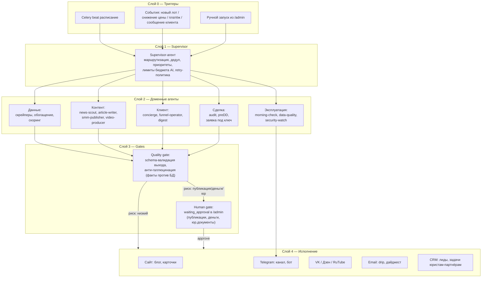

# Земля.ОНЛАЙН — блюпринт многоуровневой платформы (июнь 2026)

Статус: проект архитектуры. Основа: аудит текущего кода (backend/frontend), конкурентная разведка (июнь 2026), исследование AI-ниш (deep-research 12.06.2026).

---

## 1. Видение: 7 уровней клиентского пути

Платформа закрывает весь цикл «нашёл → проверил → выиграл → освоил → заработал», а не только поиск.

| Уровень | Потребность клиента | Модуль платформы | Статус |
|---|---|---|---|
| L1 Поиск | Найти недооценённый лот | Каталог + карта + фильтры + скоринг | ГОТОВО (нужны фиксы фильтров, разд. 7) |
| L2 Оценка | Понять, стоит ли брать | AI-аудит, дисконт к рынку, ликвидность, ЗОУИТ | ГОТОВО (audit_lot 490 р., preDD 8000 р.) |
| L3 Проверка | Юридическая чистота | preDD договора, contract_parser, ст. 22/39.18 ЗК | ЧАСТИЧНО (есть preDD; добавить: проверка ПЗЗ/генплан, обременения по ЕГРН) |
| L4 Участие | Выиграть торги | «Заявка под ключ»: документы, ЭЦП, тактика ставок | НЕТ — ключевой новый модуль (разд. 4.9) |
| L5 Оформление | Зарегистрировать право | Шаблоны договоров, сопровождение регистрации, МФЦ-чеклист | НЕТ — партнёрская сеть юристов |
| L6 Освоение | Что делать с участком | Стратегии: раздел/перепродажа, ИЖС-стройка, СНТ, аренда, с/х, ТОР-льготы | НЕТ — «Стратегический советник» (AI) + обучающий контент |
| L7 Монетизация | Заработать/выйти | Калькулятор сценариев ROI, витрина «продать через нас», бухгалтерия сделки для ИП | НЕТ — долгосрок |

Принцип монетизации по уровням: L1-L2 — подписка (self-service), L3-L5 — транзакционные услуги (фикс/процент), L6-L7 — премиум-подписка + партнёрские комиссии. Это модель «services-as-software»: продаём результат, человек-партнёр валидирует.

---

## 2. Архитектура оркестрации агентов

Не «центральный оркестратор» из учебника, а **слоистая событийная архитектура** поверх того, что уже есть (Celery + beat + agent_runs + approve-очередь в /admin). Современный паттерн: supervisor + специализированные агенты + human-in-the-loop gates + идемпотентность.



### Правила (вшиты в Supervisor и BaseAgent)

1. **Идемпотентность**: каждый запуск пишет `agent_runs` (уже есть); событийные агенты получают `dedup_key` (например `news:{url_hash}`, `lot:{id}:price_drop:{date}`) — повторное событие не порождает второй запуск.
2. **Бюджет AI**: суточный лимит токенов на агента в конфиге; при исчерпании — деградация (шаблонный режим) + алерт в morning-check. Прокси-шлюз с нулевым балансом — известные грабли, агент обязан отличать «нет денег» от «ошибка кода».
3. **Quality gate перед публикацией**: выход агента валидируется Pydantic-схемой; все числа/факты в контенте сверяются с БД (цена, площадь, КН из карточки лота, не из генерации). Несовпадение → failed, не waiting_approval.
4. **Human gate** обязателен для: публикаций вовне (посты, статьи, видео), всего, что трогает деньги, юридических документов клиенту. Решение Анны в /admin → publish/skip (механика уже есть).
5. **Dead-letter + эскалация**: 2 ретрая → failed → утренний health-check показывает все failed за сутки одной строкой.
6. **Наблюдаемость**: каждый run хранит input_hash, токены, длительность, стоимость; /admin → «Агенты» показывает ленту и экономику (сколько стоит контент-конвейер в месяц).

### Почему не «единый центральный оркестратор»

Кит со скриншота (39 агентов, центральный мозг) хорош для dev-конвейера, но в проде SaaS единая точка маршрутизации = единая точка отказа и нечитаемые цепочки. Здесь оркестрация **декларативная**: beat-расписание + таблица событий → детерминированные цепочки. LLM-агент не решает «кого позвать» — это решает код; LLM работает только внутри шага (анализ, текст). Так дешевле, предсказуемее, отлаживаемо. Девелоперская оркестрация (мои сабагенты wshobson/contains-studio) остаётся на уровне разработки, в прод не едет.

---

## 3. Реестр продукт-агентов

Существующие: `tg_lot_of_the_day`, `morning_check` (services/agents/). Новые — тот же BaseAgent:

| Агент | Триггер | Что делает | Gate |
|---|---|---|---|
| `news_scout` | beat 2 ч | RSS/HTML-мониторинг: pravo.gov.ru, Росреестр, НСПД, Минсельхоз, РБК-Недвижимость, ЕРЗ, профильные TG (через RSSHub). Фильтр релевантности (ключевые слова + AI-классификатор «важно/мимо»), дедуп по url_hash → очередь news_items | нет (только сбор) |
| `news_analyst` | событие: новый news_item | AI-разбор: что меняется для инвестора в землю, какие статьи ЗК затронуты, какие лоты в БД затрагивает (регион/ВРИ) | нет |
| `article_writer` | событие: news_analyst done, score >= порога | Статья 400-700 слов для блога сайта (SEO:題 H1/H2, ключи «земельные торги», внутренние ссылки на живые лоты из БД) + анонс-пост для TG | human gate |
| `smm_publisher` | approve статьи | Публикация: блог (новый раздел /blog), TG-канал, VK, Дзен. Кросспостинг с адаптацией формата, UTM на каждый канал | после approve — авто |
| `video_producer` | еженедельно + по approve сценария | Сценарий (из статьи/разбора лота) → Higgsfield API: генерация сцен → ffmpeg-сборка (интро/аутро/субтитры) → черновик → approve → публикация TG/VK Видео/RuTube/YouTube Shorts | human gate (сценарий и финальное видео) |
| `client_concierge` | событие: входящее сообщение (TG-бот, email, форма) | Первая линия: ответы по FAQ платформы, тарифам, «как работает аудит», статус заявки. Не отвечает на юр./инвест-вопросы по существу — передаёт хэндофф. Контекст: история юзера, его тариф, его сохранённые фильтры | авто для FAQ; human gate при эскалации |
| `funnel_operator` | beat 1 ч + события воронки | Ведёт лида по состояниям (разд. 5): триггерные письма/TG-сообщения, выдача промокодов, реактивация спящих | авто (шаблоны утверждены заранее) |
| `strategy_advisor` | по запросу клиента (платно/тариф) | «Что делать с участком»: сценарии освоения с цифрами (раздел/ИЖС/аренда/с/х/ТОР), на данных лота + рынка из БД | human gate не нужен (отчёт клиенту, с дисклеймером) |
| `deal_pilot` | заказ «заявка под ключ» | Чеклист-конвейер L4: документы → ЭЦП-инструкция → календарь торгов → тактика ставок (история цен из БД) → передача юристу-партнёру | human gate на каждый внешний шаг |
| `data_quality` | beat 6 ч | Сверка: % лотов без координат/КН/PDF, расхождения фронт-бэк по фильтрам (smoke-тест каждого query-param), битые ссылки лотов | алерт в TG при деградации |
| `security_watch` | beat сутки | Анализ логов: всплески 4xx/5xx, брутфорс логина, аномалии вебхуков, истекающие сертификаты | алерт в TG |

Реализация: `services/agents/<name>.py` + задача в `tasks/agent_tasks.py` + строка в beat. Новые таблицы: `news_items`, `content_posts` (статья/пост/видео со статусами draft → approved → published, привязка к каналам), `funnel_states`.

---

## 4. Контентный конвейер (новости → статья → пост → видео)

```
news_scout → news_items → news_analyst → score
   score < 60: архив
   score >= 60: article_writer → [HUMAN GATE /admin]
        → smm_publisher → блог + TG + VK + Дзен (+ внутренние ссылки на лоты)
        → еженедельно: топ-материал → video_producer → Higgsfield → [HUMAN GATE] → видео-каналы
```

Требуется новый раздел сайта `/blog` (Next.js, SSG + revalidate): SEO-трафик — главный бесплатный канал на горизонте 6-12 мес. Каждая статья тянет 2-3 живых лота из БД (виджет «по теме сейчас торгуются») — это конверсия из читателя в пользователя.

### Higgsfield-интеграция (видео)

1. `video_producer` собирает сценарий: hook (3 сек) → проблема → 3 факта с цифрами из БД → CTA (промокод/ссылка). Форматы: вертикальный 9:16 до 60 сек (Shorts/Reels/TG) и горизонтальный разбор 3-5 мин.
2. Генерация: Higgsfield API (text-to-video сцены) + TTS русский (Yandex SpeechKit) + субтитры (Whisper-таймкоды).
3. Сборка: ffmpeg в Celery-задаче (интро/аутро-шаблон с лого v2-modern, бренд-цвета).
4. Публикация: Telegram (Bot API, видео в канал), VK Видео API, RuTube API, YouTube Data API. Все с UTM.
5. Экономика: считать стоимость генерации на ролик в agent_runs; старт — 2 ролика/нед, масштабировать по конверсии.

Замечание: у Higgsfield проверять актуальные условия API (доступ, лимиты, цены) на момент реализации; если API закрыт — fallback-пайплайн: статичные слайды + TTS + ffmpeg (работает без внешних зависимостей, хуже, но бесплатно).

---

## 5. Автоворонки

Состояния лида (таблица funnel_states, ведёт funnel_operator):

```
visitor → registered → activated (первый аудит) → trial_warm → paying → retained
                ↘ dormant (7 дней без визита) → reactivation → ...
```

Воронка A — «TG-контент» (основная сейчас):
пост/видео с UTM → лендинг → лид-магнит «Чеклист: 12 проверок участка перед торгами» (PDF за email/TG-подписку) → серия из 5 писем/сообщений (день 0: чеклист; день 1: как работает скоринг; день 3: кейс с цифрами; день 5: промокод на аудит 490 р.; день 8: оффер Pro) → существующая drip-механика (drip_tasks.py) расширяется состояниями.

Воронка B — «SEO-блог» (растим): статья → виджет живых лотов → регистрация ради алерта по региону → дальше как A с шага «день 1».

Воронка C — «Партнёрская»: школы land-инвеста (zeminvst, pro-zemli, «Мой надел», delazemelnii) — их ученикам нужен инструмент, который автоматизирует то, чему их учат. Оффер: партнёрский промокод + 20-30% рекуррентной комиссии, white-label витрина — позже. Реферальная механика в коде уже есть (бонус рефереру) — расширить до партнёрского кабинета.

Воронка D — «Бот-магнит»: TG-бот с 1 бесплатным фильтром (уже в Free) продвигать как самостоятельный продукт «лоты твоего региона в телеге» — конкурент TorgiTzarBot, у нас глубже данные. Бот = точка входа, апсейл в кабинет.

---

## 6. Обучающий контент (сценарные планы)

Серия 1 «Заработок на земле с торгов» (8 роликов, 3-5 мин, горизонтал + нарезка на шортсы):
1. Почему земля с торгов стоит 3-30% рынка — механика аукционов, голландские торги ДОМ.РФ.
2. ИЖС-стратегия: купил → размежевал → продал. Где смотреть ПЗЗ, реальная экономика.
3. Аренда → выкуп: ст. 39.3/39.18 ЗК, подводные камни.
4. Субаренда и переуступка: ст. 22 ЗК, аренда 5+ лет — что можно без согласия.
5. Банкротные земли: отличие от муниципальных торгов, риски, дисконты.
6. 12 проверок перед ставкой (= лид-магнит в видеоформате): ЗОУИТ, обременения, ТУ, расхождение площадей.
7. Тактика на аукционе: задаток, шаг, психология повторных торгов, история цен.
8. Кейс-разбор реальной сделки от поиска до продажи с цифрами.

Серия 2 «Платформа за 5 минут» (6 роликов, 60-90 сек, скринкасты):
1. Поиск: фильтры, пресеты дедлайнов, карта. 2. Скоринг и бейджи — как читать. 3. AI-аудит лота — что внутри отчёта 490 р. 4. Алерты и TG-бот. 5. preDD договора: 11 проверок. 6. Сравнение лотов и экспорт.

Каждый ролик: сценарий пишет article_writer (отдельный режим), продакшн — video_producer, публикация после approve. Серия 2 — приоритет (конвертирует регистрации в платящих), Серия 1 — охваты.

---

## 7. Аудит монетизации и фильтров (по реальному коду)

### Несоответствия фронт-бэк (исправить — мелкие PR)

Бэкенд поддерживает, на фронте отсутствуют фильтры: `category_tg`, `auction_form`, `deal_type`, `section_tg`, `submission_start_from/to`, `submission_end_from/to`, `is_bankruptcy`. Особенно `is_bankruptcy` (данные собираются, есть страница /bankrots, фильтра в каталоге нет) и даты подачи (важно для тактики). Плюс ~20 полей модели Lot собираются, но не показываются (category_kn/vri_kn/rubric_kn, land_purpose_raw, score_updated_at) — либо выводить в карточке «Данные Росреестра», либо принять как служебные. `data_quality`-агент должен смоук-тестить каждый query-param автоматически.

### Тарифная матрица: предложения

Текущее: Free / Pro 2900 / Бюро 29000 / Бюро+ 49000 / Enterprise 120000+; разовые 490 и 8000.

1. **Ценовой разрыв 2900 → 29000 (10x)** — дыра, в которую утекают «серьёзные частники». Конкурентное окно: банкротные агрегаторы берут 945-1500 р./мес за универсальный поиск. Добавить тариф **«Инвестор» ~6900-7900 р./мес**: 10 фильтров, 100 аудитов, preDD 1/мес, мониторинг полигона на карте (фича ТБанкрота — см. разд. 8), приоритет бота.
2. **Free слишком щедрый по поиску и жадный по вкусу AI**: 5 аудитов/мес у Free против 30 у Pro — слабый стимул апгрейда. Лучше: Free — 1 аудит/мес + урезанный отчёт (без ЗОУИТ и договора), но полный поиск. Полный аудит — главный «вкус» платного.
3. **Фильтры-как-ценность по тарифам**: продвинутые фильтры (% НЦ от КС, расхождение площадей, переуступка/субаренда, банкротные, даты подачи) — пометить Pro+ на UI с замком: видно всем, доступно платным. Сейчас вся мощь фильтров отдана бесплатно — главное отличие от конкурентов не монетизировано.
4. **Разовый аудит 490 р. — правильная входная точка** (ТБанкрот берёт ~2000 за разовые услуги). Не поднимать цену, поднять конверсию из него в Pro (письмо через 24 ч после аудита с промо).
5. **«Заявка под ключ» (L4)** — транзакционная услуга 15000-30000 р. фикс или 1-2% от цены лота: рынок платит юристам 15-50 тыс. Поставить как услугу в карточке лота для Pro+. Модель «оплата за результат» (ТОРГИ-РУ) подтверждает спрос.

### Безопасность (по аудиту)

Есть: JWT + refresh, bcrypt, admin-guard, TG-вебхук с секретом, paywall-проверки на экспортах. Закрыть:
1. **Rate limiting** — нет вообще. Nginx limit_req на /api/users/token и /api/users/register (брутфорс) + SlowAPI на тяжёлых эндпоинтах (поиск, AI). Без этого один скрипт положит 2 GB VPS.
2. **ЮКасса вебхук без проверки подлинности** — сейчас доверяет телу запроса. Минимум: при получении уведомления перепроверять статус платежа GET-запросом к API ЮКассы по payment_id (рекомендуемый ими паттерн), плюс IP-allowlist ЮКассы в Nginx.
3. CORS — явный origin-allowlist (только torgi-zemli.ru), не wildcard.
4. Sentry (уже в action-list) + security_watch-агент (разд. 3).
5. 152-ФЗ: уведомление РКН (в action-list), политика ОПД, согласия на формах — блокер до активного маркетинга.
6. Бэкапы Postgres: ежедневный pg_dump на внешнее хранилище (S3 Timeweb) — сейчас не видно ни одного бэкап-механизма. Это самый дешёвый страховой полис проекта.

---

## 8. Конкуренты: позиция и отстройка

Полная таблица — в отчёте разведки (16 игроков). Суть:

- **Прямая ниша свободна**: единственный заявленный прямой аналог Torgiter.ru не запущен (лендинг собирает email). Банкротные агрегаторы (ТБанкрот 945-1500+ р./мес) сильны технологически, но земля для них — одна категория из десятков, без ВРИ/ПЗЗ/кадастровой логики.
- **Уникальные активы Земля.ОНЛАЙН**: AI-оценка ликвидности именно участка; связка госторги+Авито/ЦИАН для дисконта к рынку (ни у кого); флаги субаренды/переуступки по ст. 22 ЗК (ни у кого); preDD договоров.
- **Перенять**: мониторинг нарисованного полигона на карте (ТБанкрот) — ложится на Leaflet+алерты; поиск по кадастровым кварталам (ТБанкрот/БАИДС — фактор выбора в обзорах); сортировка «лучшие сверху» как дефолт UX; шеринг-карточка лота с картой и AI-вердиктом («property stories» Land id) — вирусная механика; слои данных (рельеф, затопление) — премиум-roadmap (референс LandApp/Acres).
- **Канал, который никто не занял**: аудитория школ land-инвеста — тысячи учеников без инструмента (воронка C).

## 9. Маркетинг: проверка стратегии

Текущая стратегия TG (5 рубрик, 5 постов/нед, KPI 500-800 подписчиков к 3-му месяцу) — реалистична, тон корректный (без «гарантированного дохода» — требование ФАС учтено). Усиления:
1. Контент-конвейер (разд. 4) снимает главный риск — ручное производство 5 постов/нед выгорит за месяц. Агенты пишут, Анна аппрувит: 15 минут/день вместо 2 часов.
2. Видео — самый недооценённый канал в нише (у конкурентов его нет, у школ — главный). Шортсы из Серии 1 — охватный двигатель.
3. SEO-блог — единственный канал с накопительным эффектом; статьи из news-конвейера + программные страницы «земельные торги + {регион}» из данных БД (89 регионов = 89 посадочных).
4. Региональные TG-подборки (паттерн ТОРГИ-РУ с 64 каналами) — позже, когда бот окрепнет.
5. Посевы: профильные каналы по банкротным торгам и недвижимости, обзорщики агрегаторов (blog.sosnyakov.ru делает сравнения — попасть в обзор).

## 10. Что убрать / упростить

1. Ночной AI-батч уже отключён (правильно) — не возвращать, on-demand + кэш по hash покрывает.
2. Скрейперы ЦИАН/Домклик: если доля лотов <5% и матчинг слабый — заморозить, оставить Авито для market_price. Меньше парсеров = меньше падений.
3. Не строить собственную CRM — лиды «под ключ» вести в admin + TG-уведомления юристу-партнёру; CRM покупать, когда сделок >20/мес.
4. Vercel-вынос фронта — отложить, пока VPS держит; приоритет — бэкапы и rate limiting.
5. Не множить соцсети сразу: TG + VK + блог. Дзен/RuTube — после стабилизации конвейера.

## 11. Дорожная карта 90 дней

Фаза 1 (нед. 1-2) — фундамент: фиксы фильтров фронт-бэк, rate limiting, верификация вебхука ЮКассы, бэкапы, Sentry, действия из anna-action-list (деплой, промокод, закреп).
Фаза 2 (нед. 3-6) — контент-машина: таблицы news_items/content_posts, агенты news_scout → article_writer, раздел /blog, smm_publisher (TG+VK), лид-магнит + воронка A на drip-механике.
Фаза 3 (нед. 7-10) — деньги: тариф «Инвестор», замки на премиум-фильтрах, ребаланс Free (1 аудит), мониторинг полигона, шеринг-карточки лотов; пилот «заявка под ключ» на 3-5 клиентах вручную (валидация спроса до автоматизации).
Фаза 4 (нед. 11-13) — медиа и масштаб: video_producer + Higgsfield (или fallback-пайплайн), Серия 2 роликов, партнёрка со школами (воронка C), client_concierge в боте.

KPI ворот между фазами: Ф2→Ф3 — 10+ статей опубликовано, CTR из блога в каталог >5%; Ф3→Ф4 — конверсия Free→платный >2%, 3 оплаченные «заявки под ключ».
